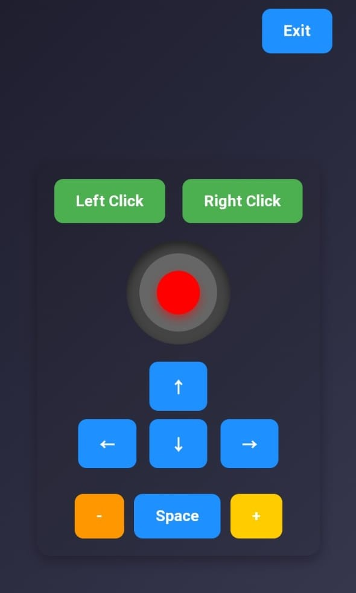

<h1 align="center">🚀 YT-MV CONTROLLER 🎮</h1>

<p align="center">
  
</p>

<p align="center">
  Control your laptop's <b>keyboard & mouse</b> using your mobile device! 🎯
</p>


## 📌 Features
✅ Control the mouse pointer with a joystick-like interface  
✅ Perform left-click and right-click actions  
✅ Use customizable hotkeys for quick navigation  
✅ Smooth and responsive controls  

---

## 🛠 Installation and Setup

Follow these steps to get started with the YT-MV Controller:

### 1️⃣ Clone the Repository
```bash
git clone https://github.com/your-username/YT-MV-Controller.git
cd YT-MV-Controller
```

### 2️⃣ Set Up Python Virtual Environment
```bash
python -m venv venv
source venv/bin/activate  # On Windows use `venv\Scripts\activate`
```

### 3️⃣ Install Dependencies
```bash
pip install -r requirements.txt
```

### 4️⃣ Run the Flask Application
```bash
python app.py
```

### 5️⃣ Access the Application
Open your browser and navigate to:  
🔗 [http://127.0.0.1:5000/](http://127.0.0.1:5000/)  

---

## 🎯 Usage Instructions
1. Open the application on your browser.  
2. Use the joystick interface to control your mouse.  
3. Click the assigned buttons for keyboard shortcuts.  
4. Enjoy seamless control over your laptop!  

---

## 📸 Screenshots  
<p align="center">
  
</p>

---

🚀 **Happy Controlling!** 🎮
